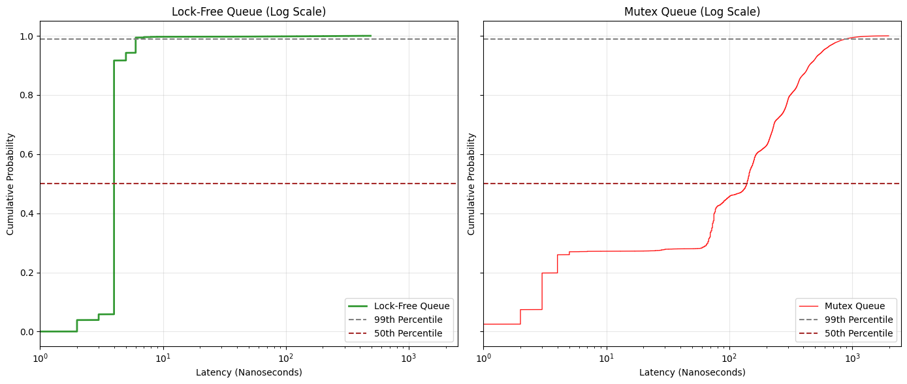

# High-Performance Concurrency Benchmark
This project provides a performance comparison between two fundamental approaches to creating thread-safe data structures in C++: 
- a simple mutex-protected queue
- a highly optimized, non-blocking (lock-free) queue

The objective is to quantify the latency and jitter differences between blocking and non-blocking synchronization primitives.

## Key Features & Achievements

| **Feature** | **Technical Benefit** | **Key Technologies / Techniques** |
| :--- | :--- | :--- |
| **Lock-Free SPSC Queue** | Achieves significantly lower and more predictable **P99 latency** by eliminating OS context switching and utilizing minimal hardware atomic operations. | Implemented using `std::atomic`, `memory_order_acquire`, and `memory_order_release`. |
| **Mutex-Protected Baseline** | Provides a reliable, thread-safe queue (`SafeQueue`) using the standard library's locking primitives. | Guarded using `std::mutex` and RAII-based `std::scoped_lock`. |
| **Micro-Latency Profiler** | Measures end-to-end message latency in nanoseconds and computes critical performance metrics like P50 and P99. | Built using `std::chrono::steady_clock`, `std::accumulate`, and `std::sort`. |


## Project Structure

| **File** | **Description** |
| :--- | :--- |
| `include/safe_queue.hpp` | Implementation of the `SafeQueue` using `std::mutex` and `std::scoped_lock`. |
| `include/lock_free_queue.hpp` | Implementation of the SPSC `LockFreeQueue` using a ring buffer and `std::atomic` indices. |
| `main.cpp` | Contains the `main` function and the generic `runBenchmark` function that spawns producer/consumer threads and calculates latency percentiles. |

## Build and Run

This project requires a C++17 or later compliant compiler (GCC 9+, Clang 10+).

```bash
cd concurrent_queue_latency_profiler
cmake .
make
./latency_profiler <queue_type>
```
`<queue_type>` can be `lockfree` or `mutex`.

## Benchmark Results

The following results were generated using 1,000,000 messages on an Apple M4 processor running the benchmark in a single-producer/single-consumer configuration. The results clearly demonstrate how lock-free design eliminates the unpredictable latency spikes (jitter) caused by OS context switching.

| Queue Type | Metric | Result (Nanoseconds) | Interpretation |
| :--- | :--- | :--- | :--- |
| **Mutex Queue** | Average (P50) | $3,541\text{ ns}$ | Represents the typical time, heavily inflated by kernel overhead. |
| | **Worst-Case (P99)** | $\mathbf{22,333\text{ ns}}$ | Shows extreme latency spikes (high jitter) caused by OS scheduling and context switching. |
| **Lock-Free Queue** | Average (P50) | $125\text{ ns}$ | Near-zero overhead, reflecting the raw speed of atomic hardware instructions. |
| | **Worst-Case (P99)** | $\mathbf{167\text{ ns}}$ | **Near-zero jitter.** The P99 is almost identical to the average, proving stable, predictable performance. |



The Cumulative Distribution Function (CDF) plot shows the performance difference. The steep, vertical line of the Lock-Free Queue indicates that 99\% of messages complete within a tight budget (low jitter), while the long, shallow tail of the Mutex Queue shows significant, unpredictable delays (high jitter).